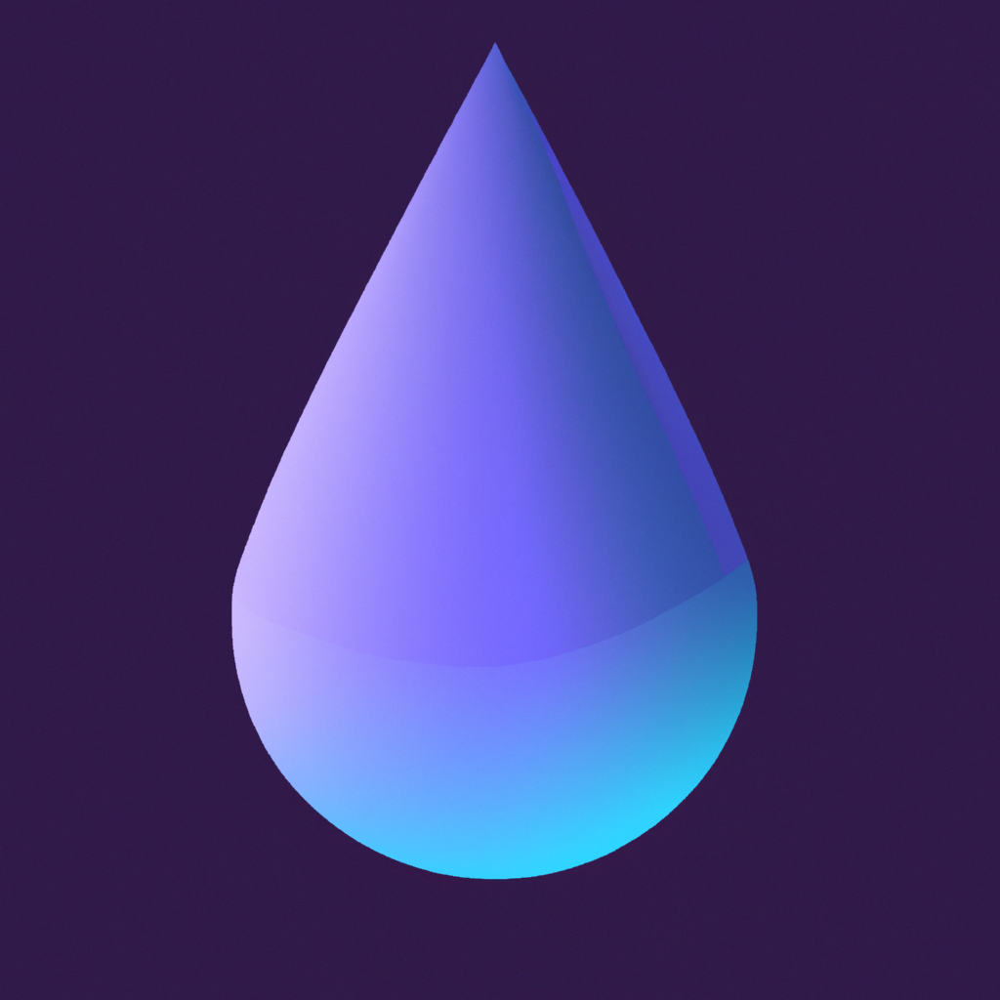

# 💧 Hidratize

<div align="center">
  
  
  [](https://swift.org)
  [](https://developer.apple.com/ios/)
  [](LICENSE)
</div>

Hidratize is a modern iOS application designed to help you maintain optimal hydration levels throughout your day. With its intuitive interface and smart features, staying hydrated has never been easier.

## 🌟 Key Features

- 📱 **Home Screen Widget**: Track your water intake directly from your home screen
- 📊 **Detailed Statistics**: Monitor your daily water consumption with comprehensive analytics
- 🔔 **Smart Reminders**: Receive personalized notifications to stay on track with your hydration goals
- 🎯 **Custom Goals**: Set and adjust your daily water intake targets
- 👤 **User Profiles**: Personalize your experience with custom user profiles
- ⌨️ **Quick Input**: Efficient keyboard interface for rapid water intake logging
- ⚙️ **Flexible Settings**: Customize the app to match your preferences
- 🌙 **Dark Mode**: Eye-friendly interface for day and night use
- ☁️ **Cloud Sync**: Keep your data synchronized across all your devices

## 🚀 Technology Stack

- **SwiftUI**: For building a modern, responsive UI
- **Core Data**: Local data persistence
- **CloudKit**: Cross-device synchronization
- **WidgetKit**: Home screen widget functionality
- **UserNotifications**: Smart reminder system

## 💻 Requirements

- iOS 15.0 or later
- Xcode 13.0 or later
- Compatible iPhone or iPad device
- Apple Developer Account (for building and deploying)

## 🛠️ Installation

1. Clone the repository
```bash
git clone https://github.com/yourusername/Hidratize.git
```

2. Open the project in Xcode
```bash
cd Hidratize
open Hidratize.xcodeproj
```

3. Configure your development team in Xcode

4. Build and run the application

## 📱 App Structure

```
Hidratize/
├── Features/
│   ├── Home/         # Main dashboard
│   ├── Stats/        # Analytics and progress
│   ├── Profile/      # User profile management
│   ├── Auth/         # Authentication
│   ├── Settings/     # App configuration
│   ├── Notifications/# Reminder system
│   └── Keyboard/     # Quick input interface
├── Utilities/        # Helper functions
└── Assets/          # Images and resources
```

## 🎯 Usage

1. First Launch:
   - Set up your profile
   - Configure your daily water intake goal
   - Enable notifications if desired

2. Daily Use:
   - Log water intake with quick-access buttons
   - Check your progress in the statistics view
   - View insights about your hydration habits

3. Widget:
   - Add the Hidratize widget to your home screen
   - Track progress at a glance
   - Quick-log functionality

## 🤝 Contributing

We welcome contributions! Here's how you can help:

1. Fork the repository
2. Create your feature branch (`git checkout -b feature/AmazingFeature`)
3. Commit your changes (`git commit -m 'Add some AmazingFeature'`)
4. Push to the branch (`git push origin feature/AmazingFeature`)
5. Open a Pull Request

## 📄 License

This project is licensed under the MIT License - see the [LICENSE](LICENSE) file for details.

## 👥 Authors

- [@saulram](https://github.com/saulram) - Creator and main developer

## 🙏 Acknowledgments

- Thanks to all beta testers who helped shape the app
- The SwiftUI community for their invaluable resources
- All users who trust Hidratize for their daily hydration tracking

---

<div align="center">
  <sub>Love Hidratize? Give it a ⭐️ to show your support!</sub>
</div> 